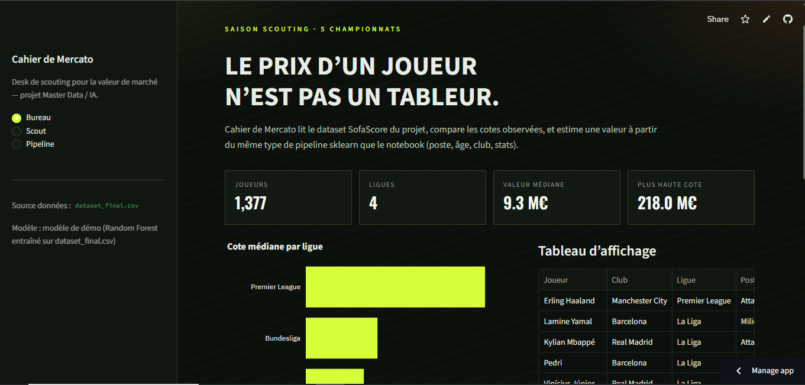
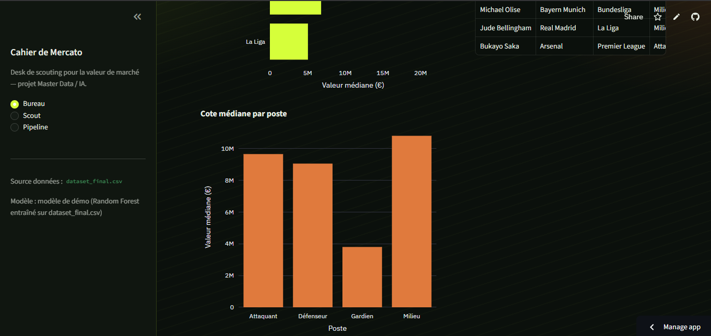
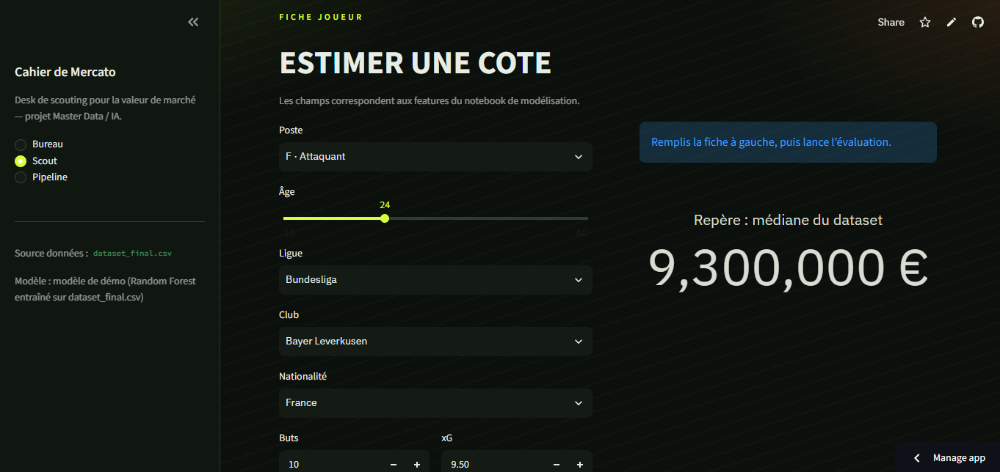

# Football market value prediction

Scraping SofaScore data, cleaning it, storing it in PostgreSQL, then estimating a player's market value with scikit-learn. A small Streamlit app is included to try the model.

Live demo: [https://football-market-value-prediction.streamlit.app](https://football-market-value-prediction.streamlit.app/)

## Screenshots





## What you need

- Python 3.10+
- pip
- Git
- Docker Desktop — only if you want PostgreSQL locally

## Run the app locally

From the project root:

```bash
git clone https://github.com/BkHassan/football-market-value-prediction.git
cd football-market-value-prediction

python -m venv .venv
# Windows
.venv\Scripts\activate
# macOS / Linux
# source .venv/bin/activate

pip install -r requirements.txt
streamlit run app.py
```

Open [http://localhost:8501](http://localhost:8501).

The app reads `data/processed/dataset_final.csv`. If `modele_marche_joueur.pkl` is present it uses it; otherwise it trains a Random Forest on the CSV.

### Pages

- **Bureau** — counts, charts, top market values from the dataset
- **Scout** — fill a player profile, get an estimated value, see similar players
- **Pipeline** — short overview of scraping → CSV → Postgres → model

## PostgreSQL (optional)

```bash
cp .env.example .env
docker compose up -d
python src/load_to_postgres.py
```

Check:

```bash
docker compose exec db psql -U marketvalue -d marketvalue -c "SELECT COUNT(*) FROM players_ml;"
```

Stop:

```bash
docker compose down
```

## How to test

1. `streamlit run app.py` — Bureau loads without error, Scout returns a value in €.
2. `python src/load_to_postgres.py` — after Docker is up, you should see row counts for `players`, `player_stats`, `players_ml`.
3. Notebooks (optional): `notebooks/fusion_des_fichers.ipynb` for the merge, `executed_notebooks/model.ipynb` for training.

## Stack

Python, Pandas, scikit-learn, PostgreSQL 16, Docker Compose, SQLAlchemy, Streamlit.
